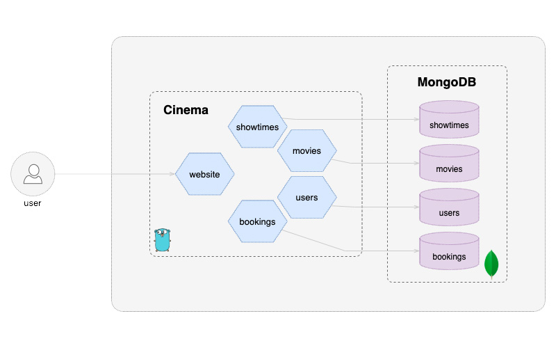

# Cinema - пример микросервисов на Go с Docker, Kubernetes и MongoDB

## Обзор

Cinema — пример проекта, который показывает использование микросервисов для вымышленного кинотеатра.
Бэкенд Cinema состоит из 4 микросервисов, написанных на Go. Для хранения данных используется MongoDB, а Docker помогает изолировать и запускать всю экосистему.

 * Сервис фильмов: хранит информацию о фильмах, например название, рейтинг и другие данные.
 * Сервис сеансов: хранит информацию о расписании показов.
 * Сервис бронирований: хранит информацию о бронированиях.
 * Сервис пользователей: хранит данные пользователей и взаимодействует с другими сервисами.

Структура проекта основана на материалах:

* Структура Go-проектов: <https://peter.bourgon.org/go-best-practices-2016/#repository-structure>
* Книга Let's Go: <https://lets-go.alexedwards.net/>

Используемые контейнерные образы поддерживают несколько архитектур: `amd64`, `arm/v7` и `arm64`.

## Содержание

* [Запуск](#запуск)
* [Как использовать сервисы Cinema](#как-использовать-сервисы-cinema)
* [Полезные материалы](#полезные-материалы)
* [Скриншоты](#скриншоты)

## Запуск

Приложение можно запустить как на **локальной машине**, так и в **Kubernetes-кластере**. Для каждого варианта есть отдельная документация:

* [локальная машина (docker compose)](./docs/localhost.md)
* [kubernetes (helm)](./docs/kubernetes-helm.md)
* [kubernetes (timoni)](./docs/kubernetes-timoni.md)

## Как использовать сервисы Cinema

* [эндпоинты](./docs/endpoints.md)

## Полезные материалы

* [Микросервисы - Martin Fowler](http://martinfowler.com/articles/microservices.html)
* [Документация Traefik Proxy](https://doc.traefik.io/traefik/)
* [Go-драйвер MongoDB](https://www.mongodb.com/docs/drivers/go/current/)
* [Канал MongoDB про Go](https://www.youtube.com/c/MongoDBofficial/search?query=golang)

## Скриншоты

### Архитектура

### Главная страница

### Список пользователей

