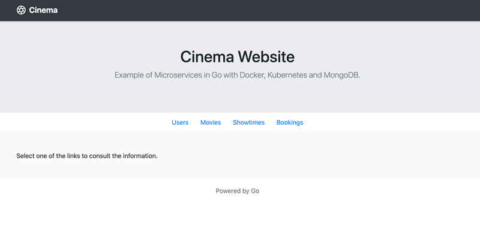
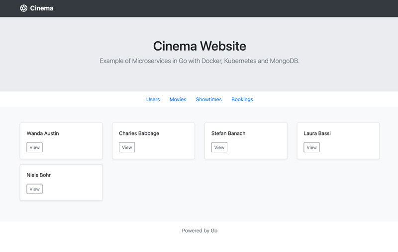
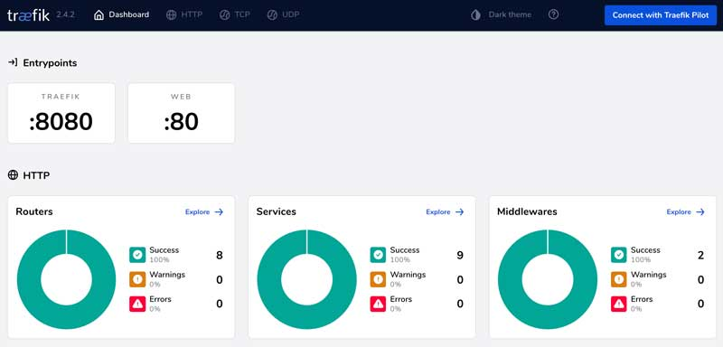

# Cinema - запуск локально

## Обзор

Проект Cinema можно запустить на одной машине через Docker Compose V2.

## Содержание

* [Локальный запуск через Docker Compose](#обзор)
* [Требования](#требования)
* [Запуск сервисов](#запуск-сервисов)
* [Восстановление данных в базе](#восстановление-данных-в-базе)
* [Открытие API микросервисов](#открытие-api-микросервисов)
* [Остановка сервисов](#остановка-сервисов)
* [Dashboard Traefik Proxy](#dashboard-traefik-proxy)
* [Сборка из исходного кода](#сборка-из-исходного-кода)

## Требования

* Docker Engine 20.10.22
* Docker Compose v2.15.1

## Запуск сервисов

Чтобы запустить все сервисы локально, выполните команду `compose up`.

```bash
docker compose up --detach
```

<details>
  <summary>Вывод</summary>

  ```bash
  [+] Running 7/7
  ⠿ Container cinema-website-1    Started
  ⠿ Container cinema-db-1         Started
  ⠿ Container cinema-showtimes-1  Started
  ⠿ Container cinema-bookings-1   Started
  ⠿ Container cinema-users-1      Started
  ⠿ Container cinema-proxy-1      Started
  ⠿ Container cinema-movies-1     Started
  ```
</details>

Проверить запущенные контейнеры можно так:

```bash
docker compose ps
```

<details>
  <summary>Вывод</summary>

  ```
  NAME    IMAGE                                      COMMAND   SERVICE      PORTS
  .....   cinema-bookings:v2.2.1    .....     bookings
  .....   mongo:4.2.23                               .....     db           27017/tcp
  .....   cinema-movies:v2.2.1      .....     movies
  .....   traefik:v2.4.2                             .....     proxy        0.0.0.0:80->80/tcp, 0.0.0.0:8080->8080/tcp
  .....   cinema-showtimes:v2.2.1   .....     showtimes
  .....   cinema-users:v2.2.1       .....     users
  .....   cinema-website:v2.2.1     .....     website
  ```
</details>

После запуска сервисов сайт будет доступен по ссылке: <http://localhost>.



## Восстановление данных в базе

После первого запуска база данных будет пустой. Если нужны заранее подготовленные тестовые данные, выполните команду:

```bash
docker compose exec db mongorestore \
  --uri mongodb://db:27017 \
  --gzip /backup/cinema
```

<details>
  <summary>Вывод</summary>

  ```
  .....  preparing collections to restore from
  .....  reading metadata for movies.movies from /backup/cinema/movies/movies.metadata.json.gz
  .....  reading metadata for showtimes.showtimes from /backup/cinema/showtimes/showtimes.metadata.json.gz
  .....  reading metadata for users.users from /backup/cinema/users/users.metadata.json.gz
  .....  reading metadata for bookings.bookings from /backup/cinema/bookings/bookings.metadata.json.gz
  .....  restoring bookings.bookings from /backup/cinema/bookings/bookings.bson.gz
  .....  no indexes to restore
  .....  finished restoring bookings.bookings (2 documents, 0 failures)
  .....  restoring movies.movies from /backup/cinema/movies/movies.bson.gz
  .....  no indexes to restore
  .....  finished restoring movies.movies (6 documents, 0 failures)
  .....  restoring showtimes.showtimes from /backup/cinema/showtimes/showtimes.bson.gz
  .....  no indexes to restore
  .....  finished restoring showtimes.showtimes (3 documents, 0 failures)
  .....  restoring users.users from /backup/cinema/users/users.bson.gz
  .....  no indexes to restore
  .....  finished restoring users.users (5 documents, 0 failures)
  .....  16 document(s) restored successfully. 0 document(s) failed to restore.
  ```
</details>

Эта команда заходит в контейнер MongoDB, то есть в сервис `db`, описанный в `compose.yaml`. После завершения восстановления данные будут готовы к использованию. Например, можно снова открыть список пользователей: <http://localhost/users/list>.



## Открытие API микросервисов

По умолчанию API микросервисов не открыты наружу напрямую. Это сделано для большей безопасности. Если нужно открыть их для тестирования, можно включить labels Traefik для Docker provider.

```yaml
    labels:
      # Включить публичный доступ
      - "traefik.http.routers.users.rule=PathPrefix(`/api/users/`)"
      - "traefik.http.services.users.loadbalancer.server.port=4000"
```

После открытия сервисов будут доступны такие ссылки:

| Сервис | Описание |
|--------|----------|
| [Traefik Proxy Dashboard](http://localhost:8080/dashboard/#/) | Позволяет смотреть компоненты Traefik: routers, provider, services, middlewares и другие |
| [API списка пользователей](http://localhost/api/users/) | Возвращает всех пользователей |
| [API списка фильмов](http://localhost/api/movies/) | Возвращает все фильмы |
| [API списка сеансов](http://localhost/api/showtimes/) | Возвращает все сеансы |
| [API списка бронирований](http://localhost/api/bookings/) | Возвращает все бронирования |

Пример команды для получения списка пользователей:

```bash
curl -X GET http://localhost/api/users/
```

<details>
  <summary>Вывод</summary>

  ```
  [{"ID":"600209d347932ef15c50af15","Name":"Wanda","LastName":"Austin"},{"ID":"600209d347932ef15c50af16","Name":"Charles","LastName":"Babbage"},{"ID":"600209d347932ef15c50af17","Name":"Stefan","LastName":"Banach"},{"ID":"600209d347932ef15c50af18","Name":"Laura","LastName":"Bassi"},{"ID":"600209d347932ef15c50af19","Name":"Niels","LastName":"Bohr"}]
  ```
</details>

## Остановка сервисов

```bash
docker compose stop
```

<details>
  <summary>Вывод</summary>

  ```
  [+] Running 7/7
  ⠿ Container cinema-website-1    Stopped
  ⠿ Container cinema-db-1         Stopped
  ⠿ Container cinema-bookings-1   Stopped
  ⠿ Container cinema-showtimes-1  Stopped
  ⠿ Container cinema-movies-1     Stopped
  ⠿ Container cinema-users-1      Stopped
  ⠿ Container cinema-proxy-1      Stopped
  ```
</details>

## Dashboard Traefik Proxy

В проекте используется Traefik Proxy v2.4.2. Dashboard должен выглядеть примерно так: <http://localhost:8080/dashboard/#/>.



Дальше: [эндпоинты](endpoints.md)

## Сборка из исходного кода

Если нужно добавить функциональность, исправить ошибку или протестировать изменения, можно собрать Docker-образ из исходного кода через Docker Compose. Для этого у нужного микросервиса оставьте `build` и уберите или закомментируйте `image`.

```yaml
  users:
    build: ./users                                   # оставить эту строку
    # image: cinema-users:v2.1.0                    # закомментировать эту строку
    command:
      - "-mongoURI"
      - "mongodb://db:27017/"
    #   - "-enableCredentials"
    #   - "true"
    # environment:
    #   MONGODB_USERNAME: "demo"
    #   MONGODB_PASSWORD: "e3LBVTPdlzxYbxt9"
    labels: {}
      # Включить публичный доступ
      # - "traefik.http.routers.users.rule=PathPrefix(`/api/users/`)"
      # - "traefik.http.services.users.loadbalancer.server.port=4000"
```
